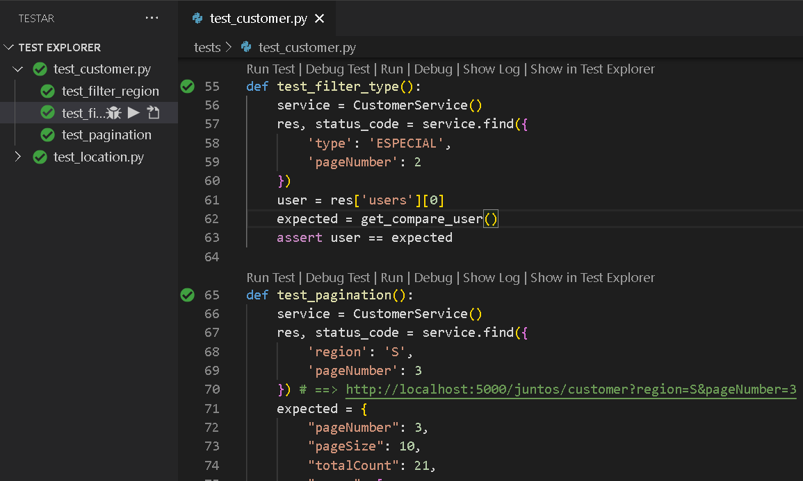

# Desafio _Juntos Somos Mais_

##### Solução: `Júlio Cascalles`

---
### Preparando o ambiente
> pip install -r requirements.txt

> python app.py

---
### Como rodar
Use algum programa como Postman, Insomnia -- mas eu recomendo testar no próprio navegador (Chrome, Firefox...):
`http://localhost:5000/juntos/customer?region=N&pageNumber=3`

**Argumentos**:
- region:
    - N: para Norte
    - S para Sul
    - E para Leste
    - W para Oeste
- type: 
    - TRABALHOSO
    - ESPECIAL
    - NORMAL
- pageNumber: Qual página você deseja
- pageSize: O tamanho da página (em registros) que você deseja

---
### Pastas do projeto
* **model**: Contém as classes que formatam os dados de acordo com o esperado;
* **service.db**: São classes que carregam dados de JSON ou CSV e permitem consultas nesses dados;
* **service**: Outros serviços como cálculos de localização e resposta à requisição do _customer_
* **view**: Representa os endpoints da API com seus verbos (No caso existe apenas o GET para customer);
* **tests**: Testes unitários (ver abaixo!)

---
### Testes unitários
Foram testados os serviços principais nas seguintes situações:
* Location
    * Regiões esperadas para determinadas coordenadas: Nordeste e Sudoeste;
    * Tipos de usuário de acordo a localização: TRABALHOSO, ESPECIAL e NORMAL.
* Customer: 
    * filter: Usando dados fictícios, deve 
retornar uma lista de usuários que obedecem os parâmetros da pesquisa;
    * paginação: Verifica se tamanho e posicionamento da página de dados estão corretos.

